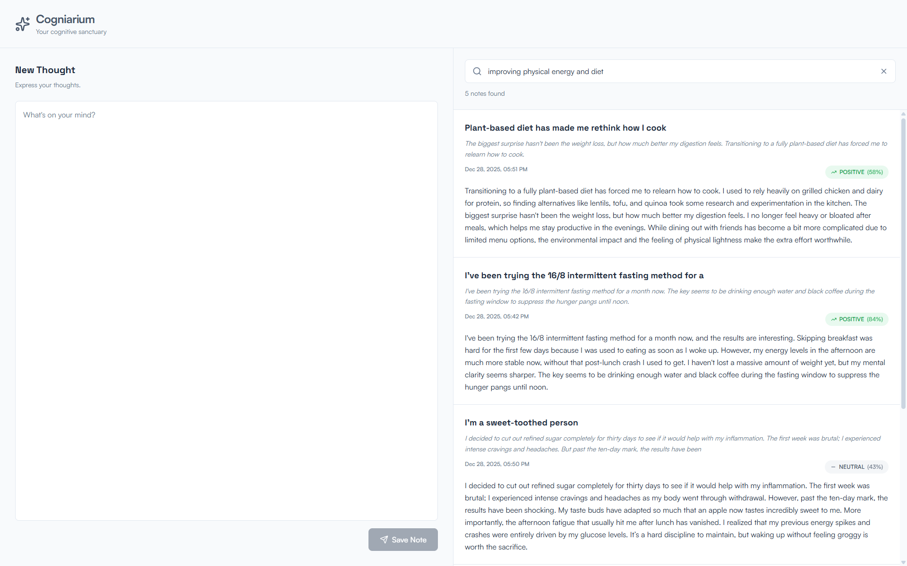

# Cogniarium

Cogniarium is a privacy-first, self-hosted note-taking application powered by AI. All processing runs entirely on your local machine no external API calls, no data leaves your system.

It allows you to search your notes semantically, generate titles and summaries, and perform sentiment analysis.

---



---

## Features

- **Sentiment Analysis:** Analyze the emotional tone of your notes (Positive, Negative, Neutral).

- **Title Generation:** Automatically generate short, context-aware titles for your notes based on their content.

- **Summarize:** Automatically generate concise summaries of your longer notes.

- **Semantic Search:** Search your notes by meaning rather than keyword matching. A search for "cooking attempts" can find notes containing "burnt lasagna recipe" even without exact keyword overlap.

## Technical Details

- PostgreSQL + pgvector for vector embeddings
- Python AI Microservice using:
  - `google/flan-t5-base` for title generation
  - `facebook/bart-large-cnn` for summarization
  - `cardiffnlp/twitter-roberta-base-sentiment-latest` for sentiment analysis
  - `sentence-transformers/all-MiniLM-L6-v2` for semantic search embeddings
- All operations run locally within the Docker network
- Optimized models selected for a balance between performance and quality

## Getting Started

### Option 1: Run Everything with Docker

Start all services (database, AI service, backend, and frontend) with Docker:

```bash
docker compose --profile full up --build -d
```

Access the application at:
- **Frontend**: http://localhost:3000
- **Backend API**: http://localhost:8080
- **AI Service**: http://localhost:8000
- **Database**: localhost:5433

### Option 2: Run Only Infrastructure Services with Docker

Start only the database and AI service with Docker, then run backend and frontend locally:

```bash
# Start database and AI service
docker compose up -d

# Run backend locally (in cogniariumbackend directory)
./gradlew bootRun

# Run frontend locally (in cogniarium-frontend directory)
npm run dev
```

This setup is useful for development:
- **Database**: Available at `localhost:5433`
- **AI Service**: Available at `http://localhost:8000`
- **Backend**: Runs locally on `http://localhost:8080` (connects to Docker services)
- **Frontend**: Runs locally on `http://localhost:5173` (Vite dev server)

### Stopping Services

To stop all services (including frontend and backend containers):

```bash
docker compose --profile full down
```

To stop only infrastructure services (database and AI service):

```bash
docker compose down
```

## Planned Features

- [ ] **Note Editing & Deletion:** Edit and delete existing notes (currently only creation is supported)
- [ ] **Authentication & Authorization:** User management, login/logout, session management for production use
- [ ] **Pagination:** Implement pagination for note lists to improve performance and scalability (currently all notes are loaded at once)
- [ ] **Error Handling & User Feedback:** Toast notifications, error messages, and better loading states for improved UX
- [ ] **Note Organization:** Tags/categories, folders/collections, and favorites/bookmarks for better note management
- [ ] **Filtering & Sorting:** Filter by sentiment (Positive/Negative/Neutral), date range, and various sorting options
- [ ] **Export/Import:** JSON/CSV export functionality and backup/restore capabilities for data portability
- [ ] **Note Detail View:** Full note detail page for viewing complete content (currently only list view exists)
- [ ] **Rich Text Editing:** Markdown support, formatting options, and link support (currently only plain text)
- [ ] **Settings & Preferences:** User-configurable similarity threshold, theme preferences, and search preferences
- [ ] **Caching:** Cache search query embeddings and note lists for improved performance
- [ ] **Rate Limiting:** API rate limiting (to be implemented alongside Redis Queue)
- [ ] **Retry Mechanism:** Retry logic for failed callbacks to ensure reliability
- [ ] **Analytics & Stats:** Note statistics (total count, sentiment distribution) and search analytics
- [ ] **Redis Queue:** Distributed queue system (similar to Celery) for handling embedding generation requests in production environments
